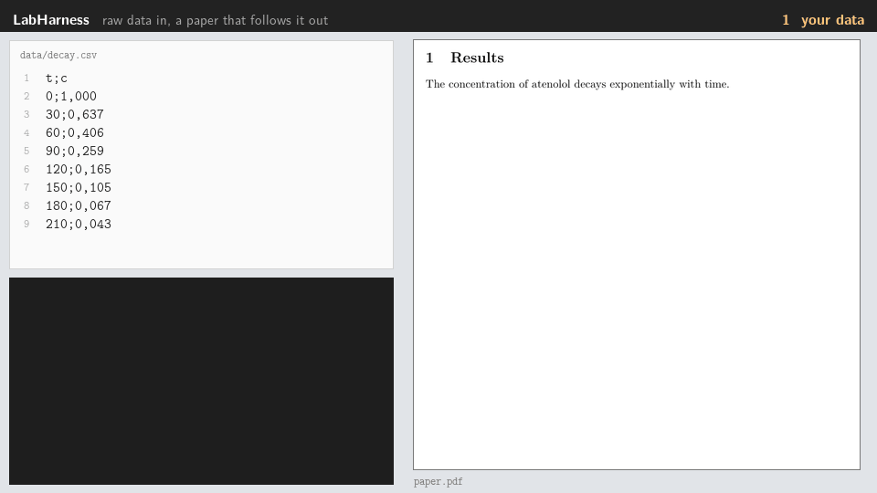

# LabHarness

Turn raw lab data into publication-ready LaTeX figures, and keep the PDF in sync while you work.



<sub>Every step above ran for real: the commands, their output and timings, and each page of the PDF. Regenerate it with `uv run python tools/make_readme_gif.py`.</sub>

> **Status: alpha.** The latest release is v0.1.0; `main` is on its way to v0.5 and already
> has tables, five templates, a choice of typeface and engine, protected raw data and `eject`.
> Everything described below runs on `main` today. See [Progress](#progress) for what is done
> and what is next.

LabHarness is a local-first, open-source (MIT) harness for scientific writing and lab-data
automation — *Data-to-Paper*. Change a data point or a SMILES string, save, and the figure and the
PDF update on their own. The pipeline is always short, readable Python you can open and edit,
never a black box.

## How fast is it

From saving a file to seeing the PDF, measured on the author's laptop (Windows 11, MiKTeX)
with the watcher running, on a document using the ACS template:

| You change | Figure | LaTeX | **Total** |
|---|---|---|---|
| A measurement in a CSV | 0.20 s | 1.1 s | **1.3 s** |
| A SMILES string | 0.05 s | 1.05 s | **1.1 s** |
| A reaction mechanism | 3.1 s | 1.0 s | **4.1 s** |
| The text of the manuscript | — | 0.85 s | **0.85 s** |

Two things make that possible. Figure scripts run inside the watcher process, so a rebuild
never pays again for starting Python and importing RDKit or Matplotlib: the same figure takes
1.8 s from a cold start and 0.2 s once the watcher is up. And when only a figure changed,
LaTeX needs a single pass, which is what it gets. A full build runs BibTeX only when the
citations or the bibliography changed, and another pass only when LaTeX asks for one.

What is left is LaTeX itself, and mechanisms drawn with chemfig, which are slow to compile.

See what it produces in the [gallery](docs/gallery/README.md): the demo, and every template.

## Who it is for

Researchers, PhD students and science students who already write in LaTeX or Overleaf and are
comfortable with a terminal and an editor such as VS Code or Zed.

## How it works

```
 data/                     scripts/                  figures/            paper.pdf
 raw measurements   ---->  transparent scripts ----> vector figures ---> your manuscript
 .csv .smi .mol            .py and .tex              .pdf

              labharness.toml says which script uses which data
              labharness watch reacts to every save and rebuilds only what changed
```

## Principles

- **Local-first.** Everything runs on your machine; nothing needs the network by default.
- **Human-in-the-loop.** Figures come from scripts you can read, tweak or take over entirely.
- **Zero layout friction.** One typeface for the whole document, figures included, generated at
  their final printed size so nothing is ever rescaled.
- **Save and see.** No manual regeneration step.
- **Modular.** Install only the domains you use.

## Requirements

| What | Why | Notes |
|---|---|---|
| Python ≥ 3.11 | The harness | Developed on 3.12 |
| [uv](https://docs.astral.sh/uv/) | Environment and lockfile | `pip install .` also works |
| A LaTeX distribution | Compiling the document and the diagrams | MiKTeX or TeX Live/MacTeX. Perl and latexmk are not needed |
| A PDF viewer that does not lock files | Live reload | SumatraPDF (Windows), Skim (macOS). **Adobe Acrobat will not work**: it locks the PDF |
| Java *(optional)* | IUPAC name resolution with OPSIN | Only for the `iupac` extra |

## Install

### 1. The requirements

<details>
<summary>Windows</summary>

```powershell
winget install astral-sh.uv
winget install SumatraPDF.SumatraPDF
winget install MiKTeX.MiKTeX                   # or TeX Live
winget install EclipseAdoptium.Temurin.21.JDK  # optional, only for the iupac extra
```

</details>

<details>
<summary>macOS</summary>

```bash
brew install uv
brew install --cask mactex          # or basictex for a smaller install
brew install --cask skim
brew install --cask temurin         # optional, only for the iupac extra
```

</details>

<details>
<summary>Linux</summary>

```bash
curl -LsSf https://astral.sh/uv/install.sh | sh
sudo apt install texlive-full       # or a smaller scheme plus achemso, chemfig and standalone
sudo apt install default-jre        # optional, only for the iupac extra
```

Any PDF viewer that reloads on change works: Okular and Zathura both do.

</details>

### 2. LabHarness

```bash
git clone https://github.com/AIAYN-creator/Lab-Harness.git
cd Lab-Harness
uv sync --all-extras
uv run labharness doctor
```

`labharness doctor` checks the requirements above and tells you exactly what is missing and
how to install it.

Install only what you need:

| Extra | Brings | For |
|---|---|---|
| *(core)* | CLI, watcher, style, TikZ diagrams | Always |
| `chem` | RDKit, SVG to PDF conversion | Chemical structures |
| `plots` | NumPy, SciPy, Matplotlib | Regressions and plots |
| `iupac` | OPSIN (needs Java) | Names to SMILES |
| `all` | Everything above | — |

## Quickstart

```bash
labharness init my-paper --journal acs
cd my-paper
labharness add structure catalyst --input data/catalyst.smi --insert
labharness watch
```

Now open `data/catalyst.smi`, change the SMILES string and save. The structure is redrawn and the
PDF reloads in your viewer, with the timings printed in the terminal.

## Commands

All of these work today.

| Command | What it does |
|---|---|
| `labharness init [PATH] [--journal NAME] [--font NAME]` | Create a workspace from a template (`acs`, `elsevier`, `rsc-draft`, `article` or `report`) and, optionally, a typeface |
| `labharness add <kind> <name> [--input FILE...]` | Add a figure: writes the script and the manifest entry, and with `--insert` the LaTeX |
| `labharness build [--only NAME] [--no-latex]` | Rebuild figures and compile the PDF once |
| `labharness watch [--no-open] [--debounce MS]` | Watch, rebuild and recompile on every save |
| `labharness preview [--only NAME] [--document]` | Render figures (and the pages of the PDF) as PNG, to review them by eye |
| `labharness resolve NAME -o FILE` | IUPAC name to SMILES, offline |
| `labharness accept FILE` | Accept a change to a raw data file, recording who, when and what it replaced |
| `labharness hook install` | Install the git hook that refuses unaccepted changes to raw data |
| `labharness eject TARGET` | Copy the workspace into one that rebuilds without LabHarness |
| `labharness doctor` | Check the environment and print the command that fixes each problem |

**[Full command reference, options and file formats: `docs/usage.md`](docs/usage.md)**

## The workspace

```
my-paper/
├── paper.tex              # Your manuscript, from the journal template you chose
├── labharness-style.tex   # Typography and figure helpers: the only place fonts are set
├── labharness.toml        # Manifest: which script builds which figure, from which data
├── labharness.lock        # Fingerprints of the raw data: a change is reported until accepted
├── data/                  # Raw measurements. Never modified by the tool
├── figures/  tables/      # Generated vector PDFs and LaTeX tables. Never edited by hand
├── scripts/               # Transparent scripts, one per figure or table
├── references.bib
├── AGENTS.md              # Rules for AI agents, for every field
├── AGENTS.chemistry.md    # ...and the rules only chemistry needs. CLAUDE.md imports both
├── .claude/settings.json  # Stops Claude Code from writing to data/ or accepting data changes
└── compile.sh  compile.ps1
```

A script is short enough to read at a glance:

```python
# figures/catalyst.pdf -- structure of the catalyst
from labharness.modules.chem import render_structure

render_structure(smiles_file="data/catalyst.smi", output="figures/catalyst.pdf")
```

And the manifest says what depends on what:

```toml
[[figure]]
output = "figures/catalyst.pdf"
script = "scripts/catalyst.py"
inputs = ["data/catalyst.smi"]
```

## Tables

A table is written in LaTeX exactly as it was given, and changed only when you ask:

```python
# tables/optimisation.tex -- optimisation of the reaction conditions
from labharness.modules.tables import read_table, write_table

table = read_table("data/optimisation.csv")  # any CSV, TSV or TXT, every cell as written
table = table.with_uncertainty("ee (%)", "ee_err")  # 92 ± 1, rounded together
table = table.round(significant=2, columns=["conversion (%)"])
write_table(table, "tables/optimisation.tex")
```

Numbers go in siunitx columns aligned on the decimal mark, with booktabs rules and notes under
the table. Rounding is decimal, so 2.675 to two places is 2.68, not the 2.67 of floating point.

## Typography

One typeface for the entire document — text, axis labels, atom labels, mechanisms — defined once
in `labharness-style.tex`. Latin Modern by default; TeX Gyre Termes, TeX Gyre Pagella, STIX Two
and Libertinus with `font = "..."` in the manifest. The LaTeX engine is `pdflatex` by default,
or `xelatex` and `lualatex` with `engine = "..."`. Figures are generated at their final printed
size and included without scaling, so 8 pt in a figure is 8 pt on paper, and each structure is
drawn as large as the column allows.

## Progress

**v0.1 — released (0.1.0).** Chemical structures (RDKit), mechanisms and diagrams
(TikZ/chemfig), regressions and plots with error bars (SciPy/Matplotlib), the watcher, the ACS
template and offline IUPAC name resolution.

**v0.5 — daily use, in progress.** The goal is a chapter of the author's thesis with every figure
and table generated by LabHarness.

- [x] `add` and `preview`
- [x] Editorial tables from any delimited file, with correct rounding and uncertainties
- [x] Agent rules for every field, and for chemistry
- [x] Raw data protected: fingerprints, `accept`, a git hook and Claude Code deny rules
- [x] `eject`: a copy that rebuilds without LabHarness
- [ ] Reading real instrument exports robustly: separators, decimal commas, metadata rows, units
- [ ] A lab compound library, so a figure can use the compound's in-house code
- [ ] Tables rebuilt by the watcher, and `labharness add table`
- [ ] Data errors that name the row and column, without stopping the watcher

**v1.0 — public release, in progress.**

- [x] Templates: Elsevier, an RSC working layout, and A4 `article` and `report` for lab work
- [x] Five typefaces and three LaTeX engines
- [x] A full LaTeX build without Perl
- [x] CI on Linux, Windows and macOS; protected `main` and release tags; security alerts
- [x] `doctor` prints the exact command that fixes each problem
- [x] `init --journal ... --font ...`
- [ ] A test that every journal and typeface combination embeds a single typeface
- [ ] Publishing to PyPI, so `pip install labharness` works
- [x] A demo GIF at the top of this README
- [x] A [gallery](docs/gallery/README.md) of the demo and every template
- [ ] A full command reference

Nothing here is dated: see [`docs/ROADMAP.md`](docs/ROADMAP.md).

**Not planned before v2.0:** a graphical interface for people who do not use a terminal.

## Roadmap

| Version | Focus |
|---|---|
| **v0.1** | Demo-ready MVP |
| **v0.5** | Daily use: editorial tables, agent rules, protected data, lab compound libraries |
| **v1.0** | Public release: more templates, selectable typeface, PyPI |
| **v1.5** | Modular: anyone builds a package for their field; a working environment with manuscript, console and PDF |
| **v2.0** | A graphical interface for people who do not use a terminal |

See [`docs/ROADMAP.md`](docs/ROADMAP.md) for the detail.

## Contributing

Issues and pull requests are welcome. See [`CONTRIBUTING.md`](CONTRIBUTING.md) and the
[Code of Conduct](CODE_OF_CONDUCT.md). If you want to work on LabHarness itself, start with
[`docs/onboarding.md`](docs/onboarding.md); the decisions behind the design are in
[`docs/adr/`](docs/adr/).

## License

[MIT](LICENSE) © 2026 AIAYN-creator
