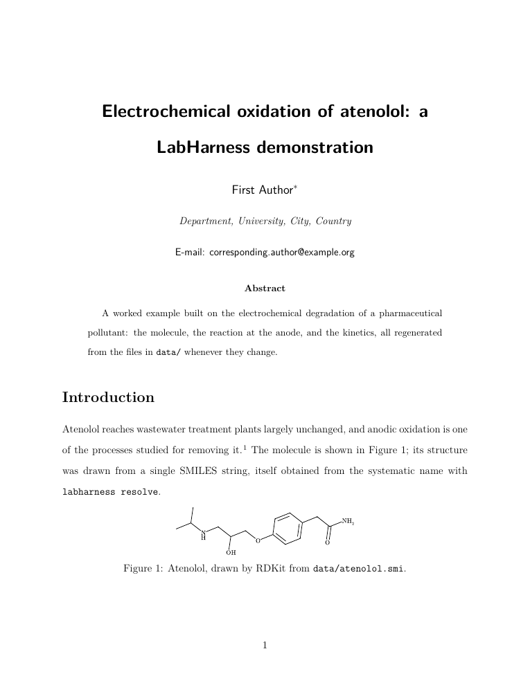
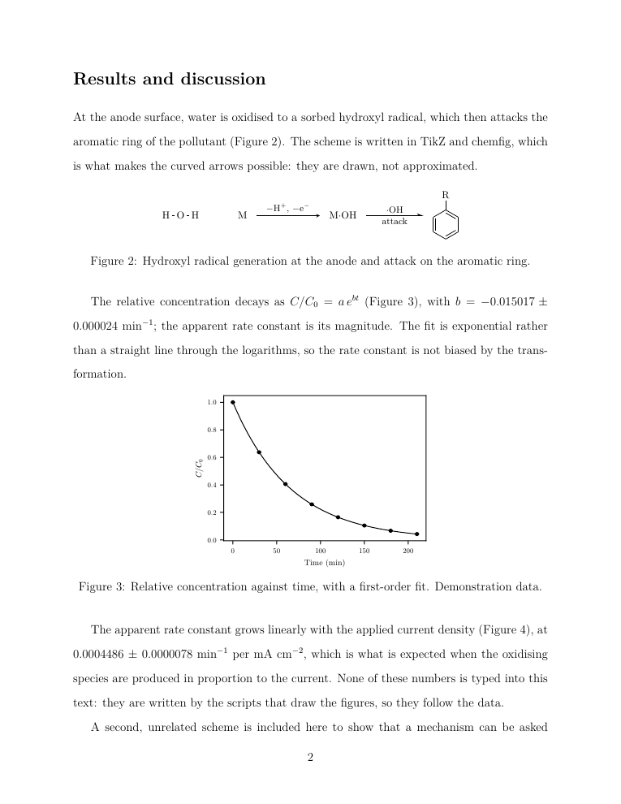
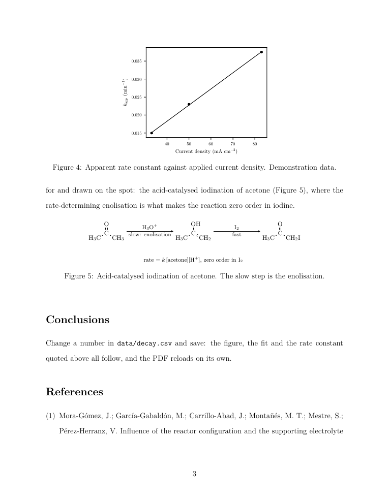
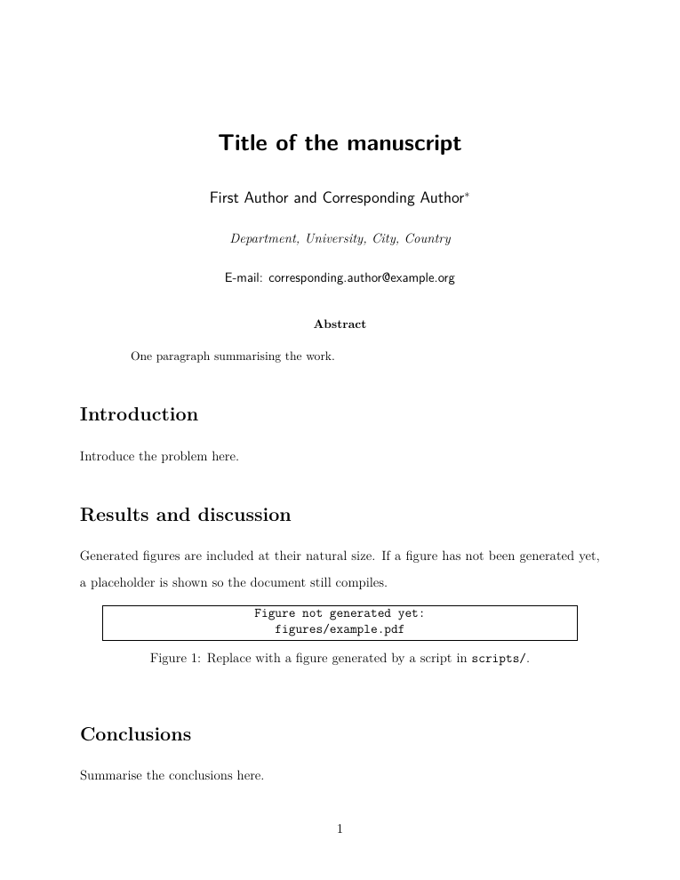
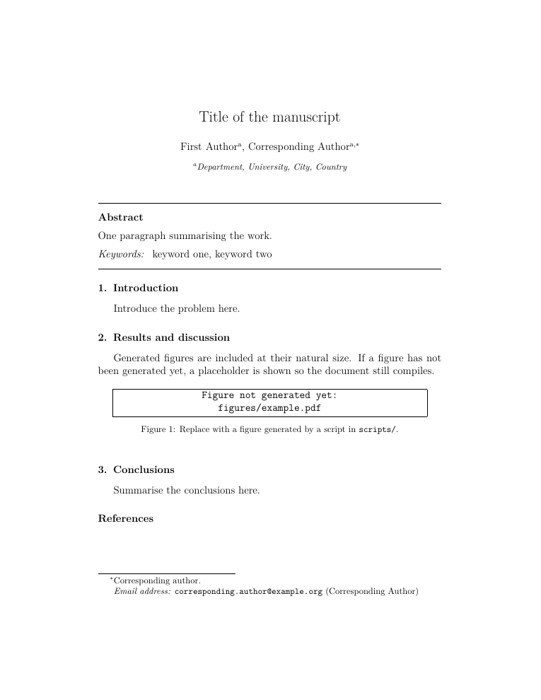
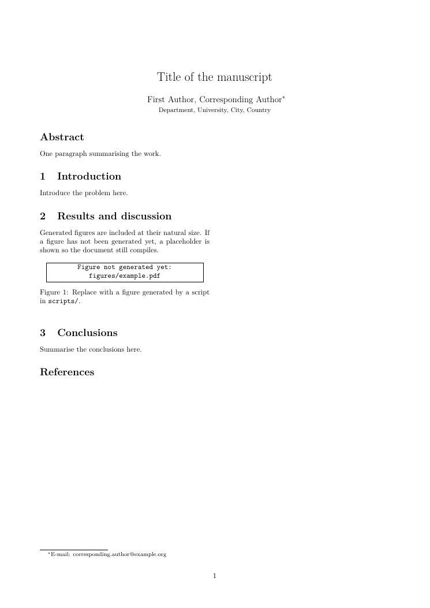
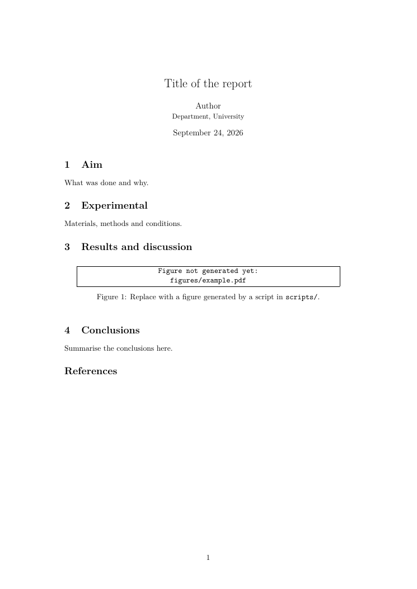
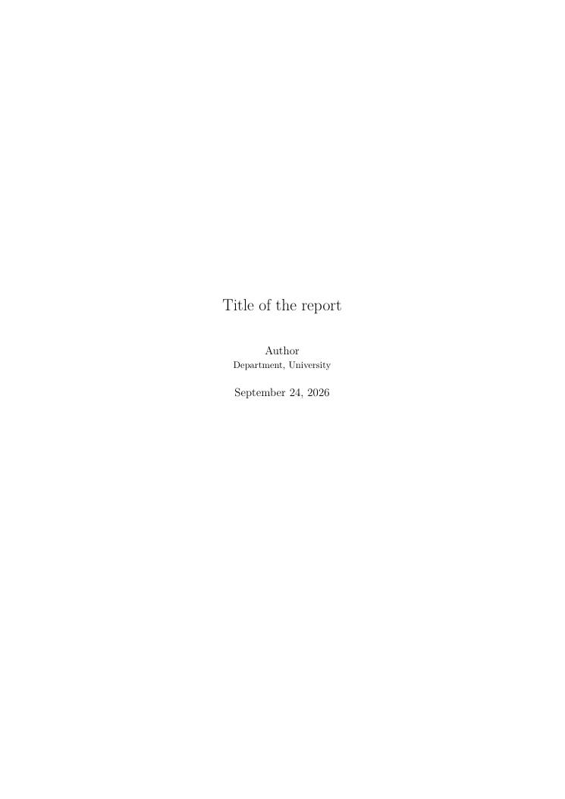

# Gallery

Every image here is a page LabHarness built from this repository, with
[`tools/make_gallery.py`](../../tools/make_gallery.py). Nothing was retouched.

## The demo

[`examples/demo`](../../examples/demo): an ACS manuscript on the electrochemical oxidation of
atenolol, with every kind of figure LabHarness draws. Build it yourself with
`cd examples/demo && labharness build`.

| | |
|---|---|
|  |  |
| **Page 1.** The structure of atenolol, drawn from `data/atenolol.smi` by RDKit, in the document's typeface and at its printed size. | **Page 2.** A reaction scheme at the anode (TikZ and chemfig), and a decay fitted to its model. The rate constant in the text is a macro the fit wrote: change the CSV and the number follows. |
|  |  |
| **Page 3.** A linear fit, and a second scheme asked for on the spot: the acid-catalysed iodination of acetone, whose slow step is the enolisation. | **Page 4.** The bibliography, through BibTeX. |

## The templates

The first page of each template, as `labharness init --journal <name>` creates it. Figures not
drawn yet show as a framed placeholder, so a new manuscript compiles from the first minute.

| `acs` | `elsevier` | `rsc-draft` |
|---|---|---|
|  |  |  |
| achemso, the official ACS class | elsarticle, the official Elsevier class | The RSC column widths on `article`: a working draft, **not** the RSC template |

| `article` | `report` |
|---|---|
|  |  |
| A short lab report on A4 | A long report or a thesis chapter: it opens with a title page and the contents |

To regenerate the images after changing a template or the demo:

```bash
uv run python tools/make_gallery.py
```
